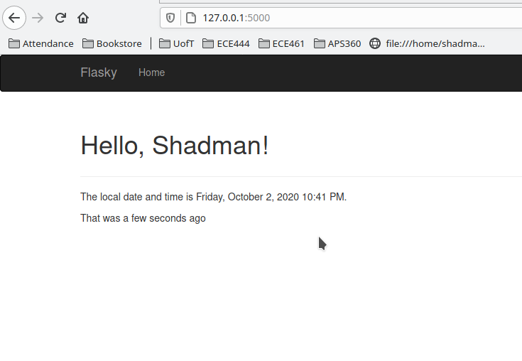
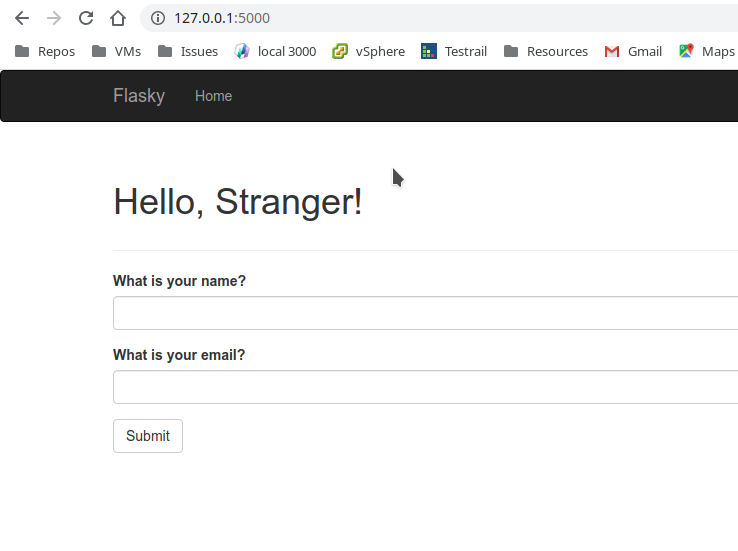
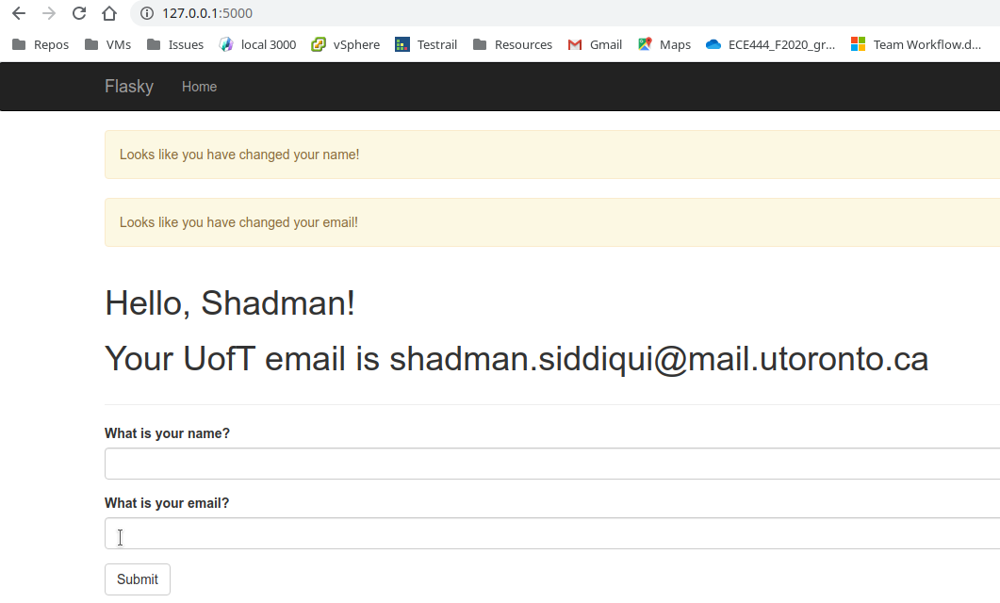
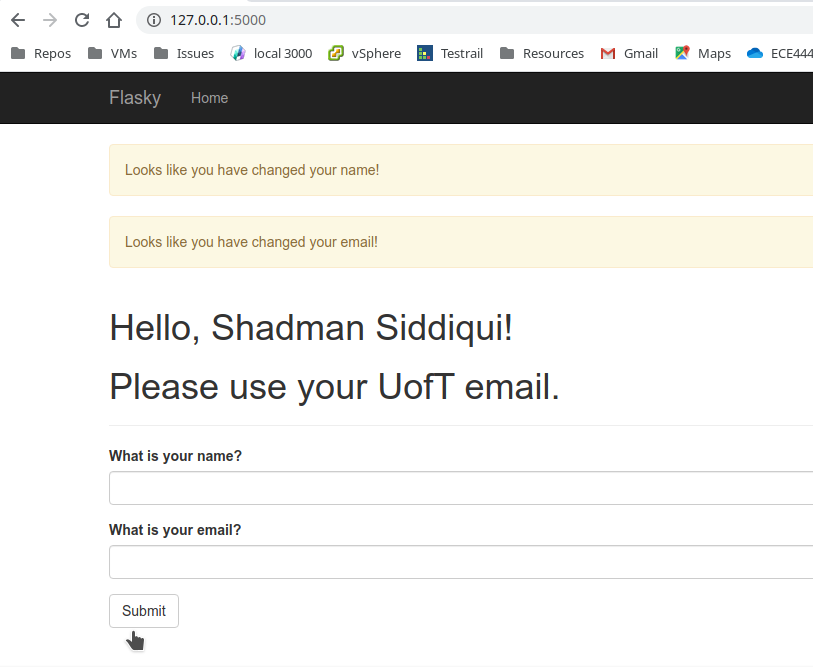

# ECE444-F2020-Lab3
Author: Shadman Siddiqui

This repo is a clone of https://github.com/miguelgrinberg/flasky

## Activity 1

---
## Activity 2
### Screenshot 1

---
### Screenshot 2

---
### Screenshot 3

---
### Screenshot 4

---
## Activity 3

### Differences between SQL and noSQL

SQL
- data is stored as rows tables
- structure of data (tables, columns) is predefined
- avoids duplication of data
- updating data in table is quick
- tables have relations through foreign keys
- DBMS performs joins on tables if needed

noSQL
- data is documents in collections
- structure of data not fixed
- data is duplicated to wherever it is needed to avoid having to join
- updating data is slow if data is to be consistent
- retrieve data quickly since all relevant attributes in document
- slow at doing joins if ever have to
