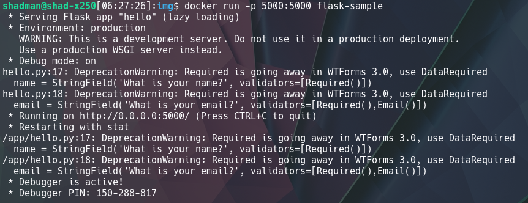

# ECE444-F2020-Lab4
Author: Shadman Siddiqui

This repo is a clone of https://github.com/miguelgrinberg/flasky

## How to run this app in a Docker container

1. Install Docker on your machine if you don't already have it: https://docs.docker.com/get-docker/

2. Build a Docker image for the app by running the following command in the root directory of the repository: `docker build -t flask-sample:latest .`
   The `docker build` command looks for a `Dockerfile` in the working directory for instructions on how to build the image. A `Dockerfile` to build the image for this app is in the root directory of this repository.
   
   If the image is built successfully, you should be able to see an image with the name `flask-sample` when you run the command `docker images`:
   
   
   
3. Launch a containerized instance of the image you built by running the command `docker run -p 5000:5000 flask-sample`. You should see the output from the running container:

    
  
   Note: You can also run the container detached from your terminal by adding the `-d` flag, i.e. `docker run -d -p 5000:5000 flask-sample`. Once the container has been started, the command will output an ID for the new container:

   

4. You can alwasy check the status of the container with the command `docker ps`. If there was no error, you should see information about the new container along with its status showing "Up":

   

5. Enter the url `0.0.0.0:5000/` in your browser. You should see the app:

   
   
   Congratulations!
